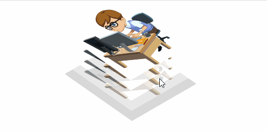
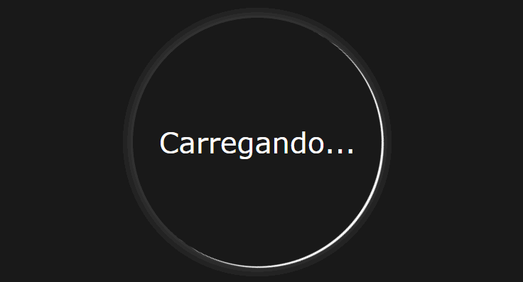
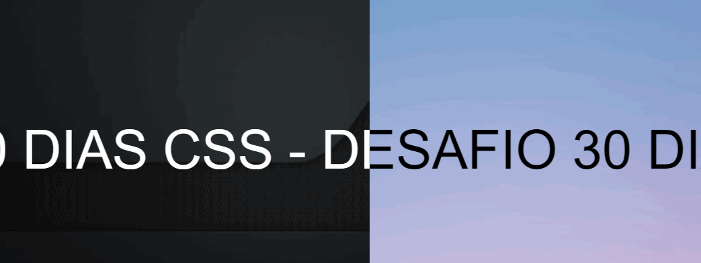
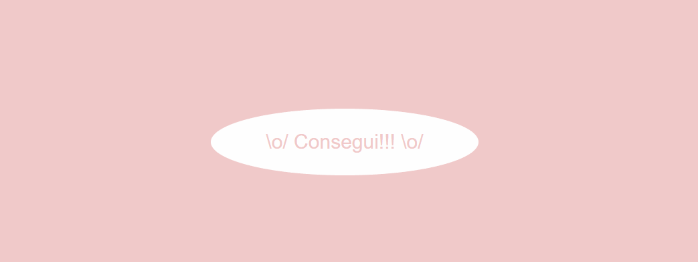

# 🤓 30 Dias de CSS 🤓
 
 Beleza Devs? 🖖

 30 dias de CSS3, é um desafio que visa ajudá-lo a melhorar suas habilidades de codificação fazendo projetinhos diários utilizando HTML5 e CSS3.

 # Objetivo

30 dias de CSS3 é um desafio que vou aceitar iniciado por [Milena Carecho](https://www.linkedin.com/in/milenacarecho/) (e você também pode participar) que visa melhorar minhas habilidades em HTML5 e CSS3 através da realização de projetos.

# Entre em contato

* [Linkedin](https://www.linkedin.com/in/rafamoliv/)
* [E-mail](dev@rafaeloliveira.tech)

# Início

O desafio foi iniciado por mim no dia 01 de agosto e será feito um projetinho por dia até o dia 30 de agosto de 2020.

# Regras gerais

* Realizar um projeto por dia
* Compartilhe seu progresso nas mídias sociais (Twitter, Facebook, Linkedin etc.) usando a hashtag #30diasDeCSS
* O projeto deve ser concluído até 23:59

# Desafios

* [Dia 01 - Imagem em camadas](#id01)
* [Dia 02 - Loader animado](#id02)
* [Dia 03 - Mudança de cor de texto entre divs](#id03)
* [Dia 04 - Botão com efeito](#id04)
* [Dia 05 - Efeito pulsar](#id05)

##  Desafio dia 01 - Imagem em camadas 

[Meu codigo](https://github.com/rafamoliv/30DiasDeCSS/tree/master/Dia%2001%20-%20Imagens%20em%20camadas)

##### O que foi aplicado

* Criar as camadas
* tranformação de um elemento
* Transições CSS
* Opacidade / transparência do CSS
* hover
* nth-child ()

##  Desafio dia 02 - Loader animado 

[Meu código](https://github.com/rafamoliv/30DiasDeCSS/tree/master/Dia%2002%20-%20Loader%20animado)

##### O que foi aplicado

* animations

##  Desafio dia 03 - Mudança de cor de texto entre divs 

[Meu código](https://github.com/rafamoliv/30DiasDeCSS/tree/master/Dia%2003%20-%20Mudan%C3%A7a%20de%20cor%20de%20texto%20entre%20divs)

##### O que foi aplicado

* CSS Overflow
* animations

##  Desafio dia 04 - Botão com efeito 

[Meu código](https://github.com/rafamoliv/30DiasDeCSS/tree/master/Dia%2004%20-%20Bot%C3%A3o%20com%20efeito)

##### O que foi aplicado

* Transitions
* transforms
* hover
* ::before and ::after

##  Desafio dia 05 - Efeito pulsar 

[Meu código](https://github.com/rafamoliv/30DiasDeCSS/tree/master/Dia%2004%20-%20Bot%C3%A3o%20com%20efeito)

##### O que foi aplicado

* animations
* transforms

## Gostou da ideia? 
[Clique aqui](https://github.com/MilenaCarecho/30diasDeCSS/issues/1) para participar 

#### Youtube Referencias dos desafios
[Online Tutorials](https://www.youtube.com/channel/UCbwXnUipZsLfUckBPsC7Jog) - 
[Creative Creations](https://www.youtube.com/channel/UCOKmVksbzoKJKmtu7rlEM1A) - 
[DarkCode](https://www.youtube.com/channel/UCD3KVjbb7aq2OiOffuungzw)